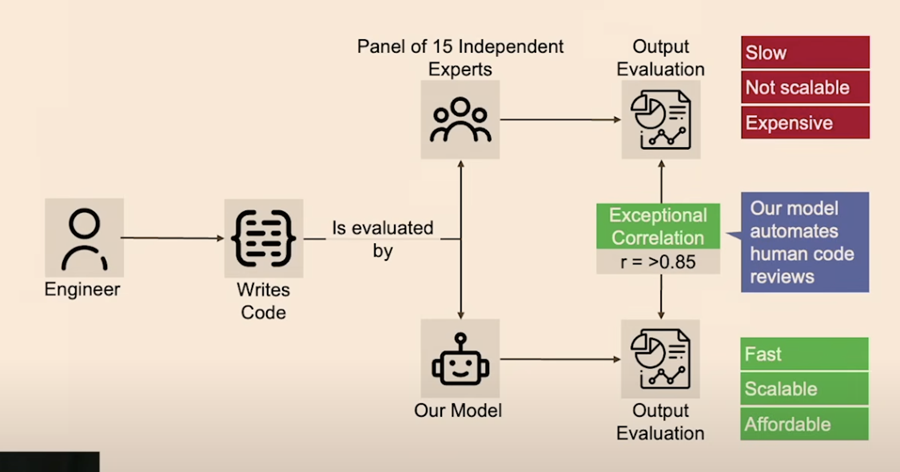
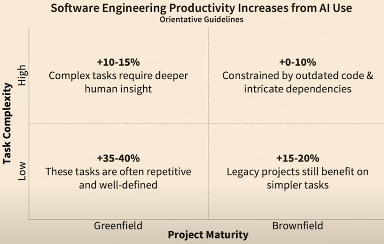
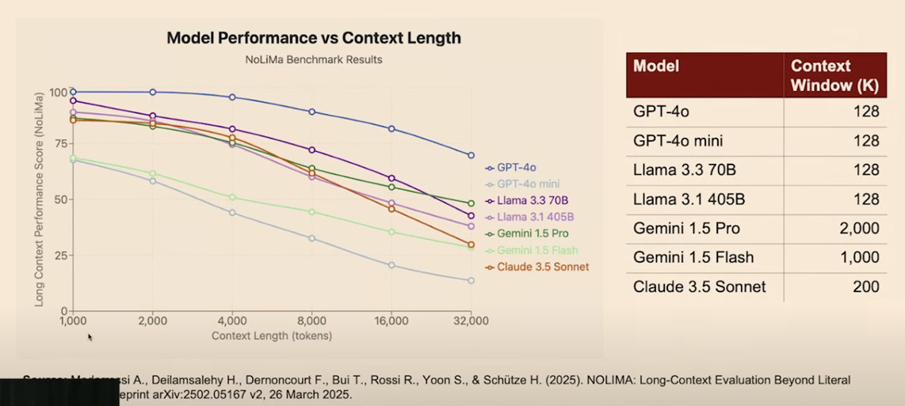

# L'AI aiuta davvero gli sviluppatori?

Questa è la domanda a cui alcuni ricercatori dell'Università di Stanford hanno cercato di rispondere in questo studio: 
["This is the Does AI Actually Boost Developer Productivity? (100k Devs Study) - Yegor Denisov-Blanch, Stanford](https://www.youtube.com/watch?v=tbDDYKRFjhk).

Mark Zuckerberg dichiarò all'inizio del 2024 che Meta avrebbe sostituito tutti gli ingegneri di medio livello con AI entro l’anno,
Questa affermazione è stata percepita da molti come una delle solite "frasi forti", da guru dei social media, per tenere alto il valore dei titoli in borsa.

Ma per molti è stata anche una provocazione: a che punto siamo con l’adozione dell’AI per sostituire sviluppatori?

<!-- more -->

## Lo studio di Stanford
L'Università di Stanford ha realizzato un interessante studio durato tre anni sulla produttività degli sviluppatori SW.

Questa ricerca si basa su:

 - serie di dati storici (analisi storica su base Git), compreso l’impatto di eventi come Covid e AI.
 - oltre 600 aziende partecipanti (grandi, medie, startup)
 - 100.000+ ingegneri, 
 - milioni di commit, miliardi di righe di codice.
 - Dataset composto in gran parte da repository privati, quindi più rappresentativi e affidabili per misurare la produttività reale.

Una delle cose più curiose che sono state scoperte analizzando questi dati è che circa il 10% degli ingegneri in analisi non produce lavoro ("**ghost engineers**"), pur percependo uno stipendio.

## Limiti degli studi precedenti
Esistono già alcune ricerche su questo argomento, ma spesso sono condotte dalle stesse aziende che producono i tools AI, con evidenti conflitti di interesse.

Le tre principali limitazioni degli attuali studi sono le seguenti:

 - **Metriche superficiali (numero di commit, PR, ecc.)**: non riflettono la reale produttività, e spesso includono fix ai bug introdotti dagli stessi algoritmi di AI.
 - **Esperimenti su greenfield tasks**: mostrano che l'AI è molto forte quando si scrive codice “*da zero*” o codice "*boilerplate*", ma sono poco rappresentativi della realtà (dove lo sviluppatore deve spesso affrontare progetti "*brownfield*", cioè su una base di codice preesistente).
 - **Sondaggi di autovalutazione**: scarsissima correlazione con la produttività reale (errore medio di 30 percentili). Sono Utili per il morale e e la percezione, ma non per misurare la produttività.

## La nuova metodologia proposta
Nel mondo ideale, la cosa migliore sarebbe quella di far valutare il codice da parte di un panel di esperti (qualità, manutenibilità, output).
Il problema è che questo metodo è lento, costoso e non scalabile. 

**La soluzione di Stanford**: un modello automatico istruito da un panel di esperti, collegato a Git, che analizza ogni commit e ne valuta il contributo in termini di funzionalità, refactoring, rework, ecc.

**Risultato**: una dashboard scalabile e precisa per misurare produttività a livello di team o azienda:

 

## Risultati principali
La produzione di codice cresce globalmente del **30–40%**, ma include molto rework (cioè correzioni e riscrittura di codice recente) e fix a bug generati dall’AI. Quindi l'aumento di produttività medio con AI è di circa il **15–20%**.

Distribuzione dei guadagni:

 - Tasks semplici: guadagni maggiori.
 - Tasks complessi: guadagni modesti o addirittura **calo di produttività**.
 - Progetti "greenfield": AI più efficace.
 - Progetti "brownfield": benefici ridotti.

Questa matrice riassume i risultati:

  

## Influenza del linguaggio di programmazione e della dimensione della codebase

Anche il linguaggio di programmazione è uno dei fattori che influenzano i risultati: 

 - Linguaggi popolari, come Python, Java, JS, TS: guadagni consistenti (+10–20%) con AI.
 - Linguaggi menu usati, come ad esempio Cobol, Haskell, Elixir: AI poco efficace o persino controproducente.

Inoltre, all’aumentare della dimensione della codebase, l’impatto positivo dell’AI diminuisce.
Le cause sono:

 - Limiti della context window: gli LLM fanno fatica a comprendere basi di codice estese.
 - Il rapporto segnale/rumore aumenta con le dimensioni della codebase.
 - Maggiori dipendenze e logiche strettamente legate al dominio in cui opera l'azienda.

Aumentare la context window non aiuta: esiste questo studio, [NoLiMa](https://arxiv.org/abs/2502.05167), che dimostra che anche con context window grandi (es. da 1k a 32k token) le performance dei modelli calano drasticamente:

 

## Conclusioni
L’AI può e deve essere usata per facilitare il lavoro di uno sviluppatore SW, ma l'aumento della sua produttività non sarà scontato.
Dipenderà dalla complessità del task, dalla maturità del progetto (greenfield vs brownfield), dalla popolarità del linguaggio, dalla dimensione della codebase, dai limiti del contesto dei modelli.

Per il momento quindi, la possibilità di sostituire gli sviluppatori con degli agenti AI non è realistica.
Il lavoro dello sviluppatore però si sta evolvendo: come gli artigiani che nel passato realizzavano le loro opere a mano si sono evoluti e oggigiorno utilizzano le macchine, così anche lo sviluppatore non è più un "tecnico" del codice, ma diventa un "pilota", un "guidatore" di strumenti che lo affiancano soprattutto in tutti quei compiti più ripetitivi e noiosi.

