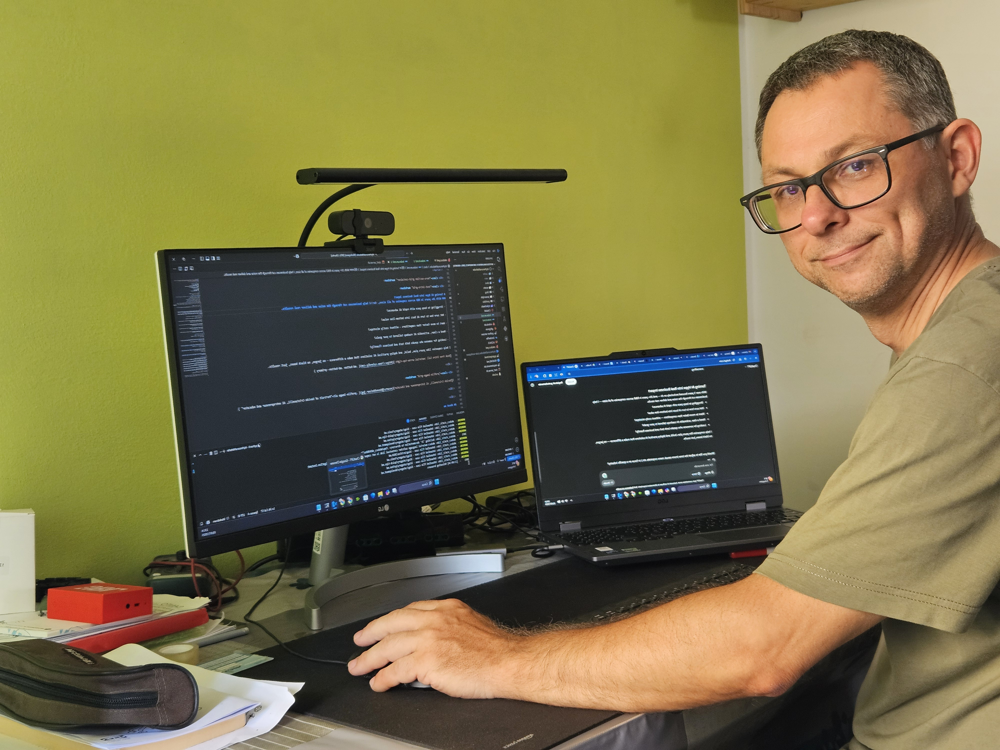

### **Automatizza i tuoi processi aziendali. Riduci errori, tempi e costi.**

### Semplifica il lavoro del tuo team con soluzioni di automazione costruite su misura per la tua azienda.

---

#### Hai ancora processi gestiti con Excel, email, carta o mille clic inutili?

Con oltre 20 anni di esperienza nello sviluppo software, aiuto le aziende manifatturiere e industriali a **ottimizzare e automatizzare i flussi di lavoro**, riducendo le attività ripetitive, gli errori umani e i costi nascosti.

---

### 👨‍💻 Chi sono

Sono un **software engineer freelance** con oltre 20 anni di esperienza in aziende piccole, medie e multinazionali. Parlo il linguaggio degli imprenditori e dei tecnici, e so trasformare esigenze complesse in soluzioni concrete.

{ .profile-image alt="Portrait of Davide Cristanelli, SW and AI Engineer" }

### ✅ Cosa posso fare per te:

-   :fontawesome-solid-building-user:{ .lg .middle } Proven Business Experience

    ---
    
    Automatizzare l'inserimento e la gestione degli ordini e documenti

-   :material-youtube:{ .lg .middle } Educator & Communicator

    ---

    Creare **workflow approvativi intelligenti** per ferie, spese, modifiche tecniche

-   :material-school:{ .lg .middle } Industry Expert
    
    ---

    Collegare il tuo ERP o gestionale ad altri strumenti via **API, integrazioni custom o piattaforme low-code**

-   :material-rocket:{ .lg .middle } Fast Implementation

    ---

    Fornire **dashboard e alert** per monitorare la produzione in tempo reale

-   :material-rocket:{ .lg .middle } Fast Implementation

    ---

    Semplificare la comunicazione con clienti e fornitori, riducendo al minimo il lavoro manuale
    
---

### 📞 Vuoi capire se possiamo collaborare?

**Prenota una breve call di conoscenza.**
Ti ascolto, ti faccio qualche domanda e ti spiego come potrei aiutarti — senza impegno.

  <a href="LINKALLACALL" style="padding: 12px 24px; background-color: #007BFF; color: white; text-decoration: none; border-radius: 6px; font-size: 18px;">Prenota una breve call di conoscenza</a>

## Frequently asked questions

??? note "How quickly can you start working on my project?"
    I can typically begin new projects within 1-2 weeks of contract signing. For urgent matters, I maintain some flexibility for rapid response situations and can potentially start sooner - just let me know your timeline during our initial consultation.

??? note "Do you require a minimum project size or commitment?"
    While I can accommodate projects of any size, I find that engagements of at least 20 hours allow for meaningful impact. This gives us enough time to understand your data, implement solutions, and deliver actionable results. We can start with a small pilot project to ensure we're a good fit.

??? note "What industries do you have experience in?"
    I've successfully delivered projects across e-commerce, manufacturing, healthcare, and financial services. While I specialize in data science fundamentals that apply across sectors, I particularly excel in projects involving customer behavior analysis, process optimization, and predictive modeling.

??? note "How do you handle data security and confidentiality?"
    I take data security extremely seriously. I sign comprehensive NDAs before starting any project, use enterprise-grade encryption for all data transfers, and follow industry best practices for data handling. I can also work within your existing security infrastructure and policies.

??? note "What's your pricing structure?"
    I offer both project-based and retainer pricing models. Project fees are based on scope, complexity, and value delivered rather than hours worked. For ongoing support, I offer flexible retainer packages. Let's discuss your specific needs during our consultation to determine the most cost-effective approach.

??? note "How do you communicate progress and results?"
    I maintain clear communication through weekly progress updates and regular check-in meetings. You'll receive detailed documentation of all analyses, findings, and recommendations. For ongoing projects, I provide interactive dashboards and reports that allow you to track progress and results in real-time.

-   :material-coffee:{ .lg .middle } Let's have a virtual coffee together!

    ---
    
    Want to see if we're a match? Let's have a chat and find out. Schedule a free 30-minute strategy session to discuss your AI challenges and explore how we can work together.

    [Book Free Intro Call :material-arrow-top-right:](https://calendly.com){ .md-button .md-button--primary }

