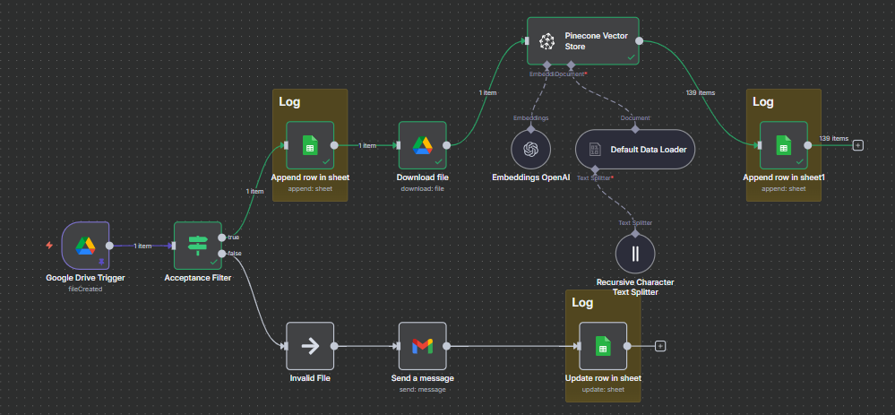

# **Case Study — RAG Chatbot built with n8n**

## **Overview**
This project consists of two main workflows:

* **Data Ingestion Pipeline:** responsible for collecting, cleaning, and structuring documents before indexing them into a vector database.
* **RAG Inference Chatbot:** manages user queries, retrieves the most relevant context from the vector store, and leverages an LLM to generate accurate, context-aware answers.

Together, these workflows create a streamlined **Retrieval-Augmented Generation (RAG) chatbot** that provides reliable responses based on the company’s knowledge base.

---

## **System Architecture**

This is the Data Ingestion Workflow block diagram:
{ alt="Data ingestion workflow, System Architecture" }

---

## **Technical Challenges & Solutions**
### Data Collection Pipeline
#### Challenges:

* **File acceptance filter:** a validation step that checks incoming files against predefined rules (e.g., type, size, required fields). This minimizes the risk of processing corrupted, incomplete, or non-compliant data, ensuring that only valid inputs move forward in the workflow.

* **Logging the result of key nodes:** systematically capturing outputs and execution details at critical workflow steps. This provides execution statistics and increases observability, making it easier to monitor performance, troubleshoot errors, and maintain the system over time.

#### Future Improvements:
 - Before embedding a new file check if the same file has already been processed

---

### RAG Inference Cahtbot
#### Challenges:

* **User input validation:** Implemented mechanisms to check and sanitize user inputs before passing them to the model. This reduces errors, prevents malicious injections, and ensures that the chatbot or system processes only clean, well-structured data.

* **Prompt engineering (system prompts and instructions):** Designed effective prompts that guide the model’s behavior, including system-level instructions and contextual cues. This helps shape responses to be accurate, consistent, and aligned with the desired tone or business goals.

* **Guardrails to avoid hallucinations:** Added constraints, filters, and verification steps to reduce the risk of the model generating inaccurate or fabricated information. Fallback strategies are used when confidence is low.

#### Future Improvements:
 - Now the workflow is using the n8n chatbot. This can be replaced by a webhook: in this way a separate client application can be used as user interface.

---

## Tech Stack

- N8N
- Google Drive 
- Google Sheets
- Pinecone (Vector Database)
- OpenAI LLM models 

---

-   :material-coffee:{ .lg .middle } Let's have a virtual coffee together!

    ---
    
    Want to see if we're a match? Let's have a chat and find out. Schedule a free 30-minute strategy session to discuss your AI challenges and explore how we can work together.

    [Book Free Intro Call :material-arrow-top-right:](https://calendly.com/davide-cristanelli/30min){ .md-button .md-button--primary }

