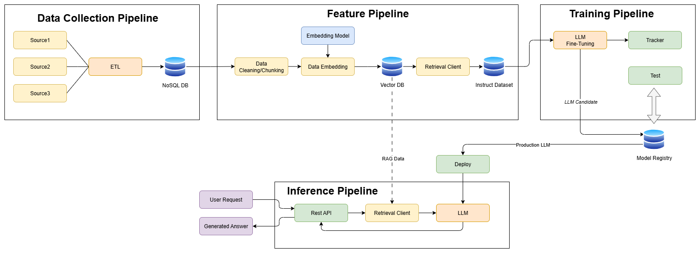

# **Case Study — AI Assistant expert in Italian legislation (tax credit for Research and Development activities)**

## **Overview**

I developed an **AI Assistant** expert in Italian legislation regarding the tax credit for Research and Development, Technological Innovation, and Aesthetic Design and Ideation Activities.

He can answer all questions regarding the regulations and, if provided with the data of the projects to be examined, he can classify the activities according to the required criteria.

To create the AI ​​assistant, an open-source LLM model was fine-tuned and deployed online on the AWS platform using *SageMaker*. For the RAG component, NoSQL (*MongoDB*) and vector databases (*Qdrant*) were used.

To control the data collection, model training and deployment processes, pipelines built with *ZenML* were used.

---

## **System Architecture**
{ alt="AI Assistant, System Architecture" }

---

## **Technical Challenges & Solutions**
### Data Collection Pipeline
#### Challenges:
 - Different sources produce different formats (JSON, CSV, HTML, PDFs, APIs).
 - Web crawling requires dealing with rate limits, inconsistent page structures, and data cleaning.
#### Solutions:
 - Build a multi-source ingestion pipeline with connectors for databases, APIs, and file storage.
 - Use ETL (Extract, Transform, Load) tools to standardize data.
 - Implement web crawlers with throttling, retries, and parsing rules.
 - Normalize into a common schema (*Pydantic*) so that all downstream models receive consistent inputs.

### Training Pipeline
#### 1. Raw data cannot be directly used to train the model
 - Business data is usually noisy, unstructured, and inconsistent.
 - Models require formatted datasets with prompt → response pairs.
 - Low-quality or mislabeled data leads to poor generalization and errors.
#### Solution:
 - Implement a data preprocessing pipeline: cleaning, deduplication, normalization, and anonymization of sensitive information.
 - Apply quality control checks (sampling, review cycles) to ensure high-quality training data.
 - Maintain a versioned dataset repository (*ZenML*) to track iterations.

#### 2. Fine-tuning is an iterative process and needs monitoring
 - Each training run requires multiple experiments (different learning rates, epochs, prompt structures).
 - Without monitoring, you risk overfitting or underfitting.
 - It’s difficult to know if improvements come from better data, better hyperparameters, or chance.
#### Solution:
- Use experiment tracking tools (*CometML*) to log training runs, metrics, and parameters.
- Define clear evaluation metrics (Training loss, Validation Loss, Gradient Norm).
- Perform validation on held-out datasets and real-world test cases to avoid overfitting.
- Automate the process with continuous training pipelines that retrain when new data is available.

#### 3. Fine-tuning is GPU intensive and expensive
 - LLM fine-tuning requires powerful GPUs (A100/H100) and long runtimes.
 - Training costs scale with dataset size, model size, and experimentation cycles.
 - Running in the cloud without cost control can burn through budgets quickly.
#### Solution:
 - Start with parameter-efficient fine-tuning (PEFT) techniques (LoRA, QLoRA) instead of full fine-tuning → drastically reduces GPU usage.
 - Use mixed precision training (FP16/BF16) to cut memory and compute costs.
 - Leverage spot/preemptible GPU instances in the cloud for non-critical training runs.
 - Continuously monitor GPU utilization and cost with built-in dashboards (AWS, GCP, Azure).
---

## **Example of Monitored metrics**

---

## Tech Stack

- Hugging Face (Model Repository)
- Llama-3.1-8B
- MongoDB (NoSQL Database)
- Qdrant (vector Database)
- AWS cloud infrastructure
- AWS SageMaker
- Python backend services
- ZenML orchestrator
- Docker containerization
- GitHub Actions for CI/CD pipeline
---

-   :material-coffee:{ .lg .middle } Let's have a virtual coffee together!

    ---
    
    Want to see if we're a match? Let's have a chat and find out. Schedule a free 30-minute strategy session to discuss your AI challenges and explore how we can work together.

    [Book Free Intro Call :material-arrow-top-right:](https://calendly.com/davide-cristanelli/30min){ .md-button .md-button--primary }

